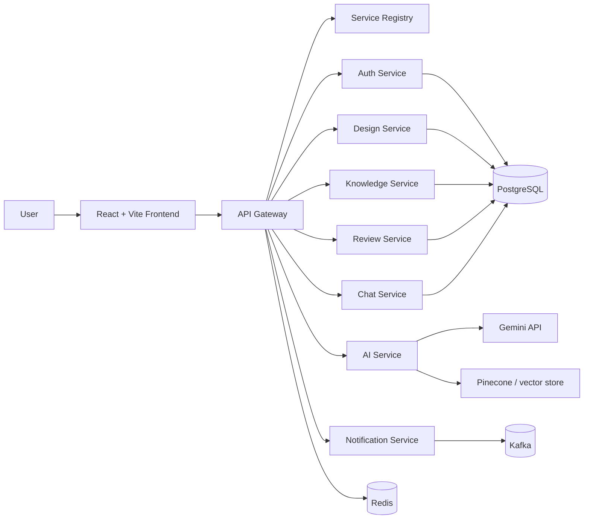

# ArchAI

AI-powered system design assistant for creating, organizing, and reviewing architecture decisions.

A Java/Spring microservices backend and React frontend for managing system designs, diagrams, and knowledge-based architecture workflows.

## Status

This project is currently in active development and is intended as a portfolio / learning project. The codebase is structured as a Spring Cloud microservice architecture and the main project build has been validated successfully.

## Highlights

- JWT-based authentication and protected API routing
- Microservice architecture with Eureka service discovery
- Design CRUD APIs with ownership scoping
- Mermaid diagram support in the frontend
- Multi-module Java backend with a React/Vite client
- Docker-based local infrastructure configuration

## Architecture



## Tech Stack

- Java 21
- Spring Boot 3.3
- Spring Cloud Gateway
- Netflix Eureka
- Spring Data JPA
- PostgreSQL
- Redis
- Kafka
- React
- TypeScript
- Vite
- Mermaid
- Docker Compose

## Repository Structure

```text
ARchai/
├── api-gateway/
├── auth-service/
├── design-service/
├── knowledge-service/
├── ai-service/
├── review-service/
├── chat-service/
├── notification-service/
├── service-registry/
├── frontend/
├── infra/
├── .env.example
├── .gitignore
├── docker-compose.yml
├── pom.xml
├── README.md
└── .env
```

## Features

### Completed / implemented

- Authentication with login and registration
- JWT issuance and validation
- API gateway request handling
- User-scoped design APIs
- Frontend login and account flow
- Design editor and diagram preview
- Project structure for a full microservice ecosystem

### Planned / in progress

- AI-generated architecture recommendations
- Knowledge-base retrieval and RAG integration
- Review workflow and collaboration services
- Notification delivery via events
- Production deployment hardening and observability

## Prerequisites

For a local Docker setup:

- Docker Desktop or Docker Engine + Compose
- Git

For direct local development without Docker:

- JDK 21
- Maven 3.9+
- Node.js 22+
- npm
- PostgreSQL
- Redis

## Quick Start

1. Clone the repository:

```bash
git clone https://github.com/YOUR_USERNAME/ArchAI.git
cd ArchAI
```

2. Create your environment file:

```bash
cp .env.example .env
```

3. Update the values in `.env` as needed, especially the JWT secret.

4. Start the full stack with Docker:

```bash
docker compose up --build
```

5. Open the app in a browser:

- Frontend: http://localhost:5173
- API Gateway: http://localhost:8080
- Eureka Dashboard: http://localhost:8761

## Alternative: Run Frontend Separately

If you are developing the frontend while infrastructure services are running:

```bash
docker compose up --build postgres redis zookeeper kafka service-registry api-gateway auth-service design-service
cd frontend
npm install
npm run dev -- --host 0.0.0.0 --port 5173
```

## Build Verification

From the repository root:

```bash
mvn -DskipTests compile
```

Frontend build:

```bash
cd frontend
npm install
npm run build
```

## Configuration

The project uses environment variables for runtime configuration. The base values are defined in `.env.example`.

Required variables include:

- `POSTGRES_DB`
- `POSTGRES_USER`
- `POSTGRES_PASSWORD`
- `JWT_SECRET`
- `GEMINI_API_KEY`
- `PINECONE_API_KEY`
- `PINECONE_INDEX_NAME`
- `VITE_API_BASE_URL`

Do not commit real secrets or production credentials. Keep local environment values in `.env` and add `.env` to the ignore list for your personal workflow.

## Local API Notes

The API Gateway is expected to run at:

```text
http://localhost:8080
```

Example authentication endpoints:

- `POST /api/auth/register`
- `POST /api/auth/login`
- `GET /api/auth/me`

Example design endpoints:

- `GET /api/designs`
- `POST /api/designs`
- `GET /api/designs/{id}`
- `PUT /api/designs/{id}`
- `DELETE /api/designs/{id}`

## Project Status and Honest Scope

This is not yet a fully production-hardened SaaS deployment. It is a working architecture and application scaffold designed for learning, experimentation, and portfolio use.

Planned next steps include:

- stronger production security checks
- more robust validation and error handling
- database migrations and operational hardening
- AI + vector-search integration
- event-driven workflows and notifications
- end-to-end testing and CI/CD setup


## Push to GitHub

Once the repository is ready, initialize and push it with:

```bash
git init
git add .
git commit -m "Initial commit"
git branch -M main
git remote add origin https://github.com/YOUR_USERNAME/ArchAI.git
git push -u origin main
```


